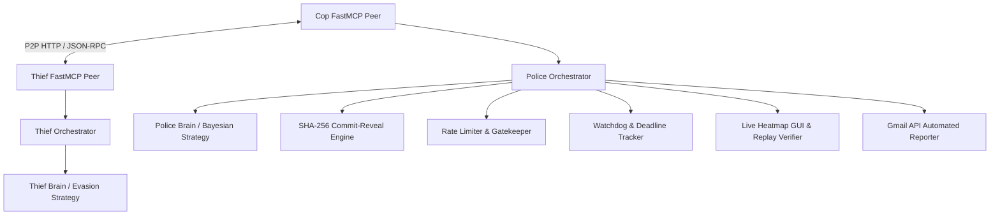

# Architecture & Implementation Plan
## Distributed Cops-and-Robbers over a Peer-to-Peer Network

### 1. System Architecture Diagram

### 2. Implementation Phases

#### Phase 1: Setup & Configuration Infrastructure
- Enforce shared contract (`config/game.json`) and private peer configs (`config/game.toml`).
- Setup root `pyproject.toml`, `uv.lock`, and `.env-example`.

#### Phase 2: Core Domain Logic & Security Engine
- Implement grid movement, barrier placement, scent emission & decay, and Manhattan distance heuristics.
- Build 4-stage SHA-256 Commit-Reveal protocol engine for zero-trust move non-repudiation.

#### Phase 3: P2P Network & Orchestration
- Build FastMCP P2P server (`police_thief_peer`) with JSON-RPC handlers.
- Build orchestrator gateway, finite state machine (`WAITING_FOR_OPPONENT` -> `COMPUTING_MOVE` -> `COMMITTING` -> `AWAITING_REVEAL` -> `VERIFYING`), and watchdog resilience.

#### Phase 4: Strategy Engines & Dual Brains
- Implement `PoliceBrain` (Bayesian belief grid update, scent trail tracking, Q-learning).
- Implement `ThiefBrain` (evasion strategy, scent dilution, verbal deception generation).

#### Phase 5: GUI, Verification & Automated Reporting
- Live GUI heatmap visualization and turn banners.
- Replay verifier engine checking log integrity (`Verified OK` vs `TAMPERED`).
- Automated Gmail API reporting compiling signed JSON match artifacts.
