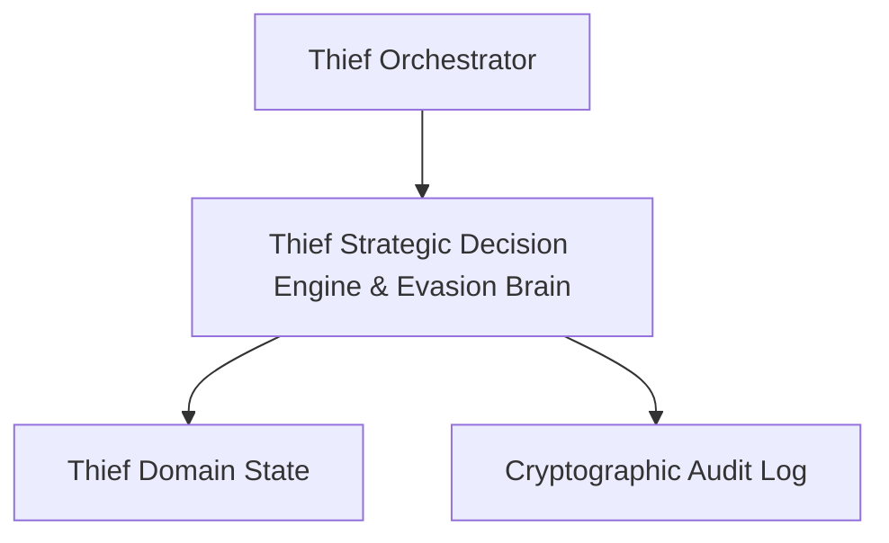

# Technical Development Plan
## Feature: Thief Strategic Decision Engine & Evasion Brain (`thief_strategy_decision_engine`)

### 1. Technical Architecture & Component Design
This development plan outlines the implementation of `thief_strategy_decision_engine` based on the requirements defined in `thief_strategy_decision_engine_prd.md`.

### 2. Technical Component Breakdown
- **Component 1**: Define core data models, constants, and validation methods.
- **Component 2**: Implement feature engine logic and state transitions.
- **Component 3**: Build unit test suite and mock integration tests.
- **Component 4**: Integrate feature into the Thief CLI entrypoints.

### 3. Dependencies & Internal Integrations
- **Runtime**: Python 3.11+
- **Internal Modules**: `src/core/`, `src/domain/`, `src/infra/`, `src/strategy/`
- **Standard Libraries**: `hashlib`, `secrets`, `dataclasses`, `typing`, `json`, `math`, `asyncio`

### 4. Implementation Strategy & Risk Mitigation
- **Phased Rollout**: Implement data types, domain algorithms, orchestrator bindings, and test suites sequentially.
- **Risk Mitigation**: Enforce zero-trust validation and strict boundary checking on all inputs.
